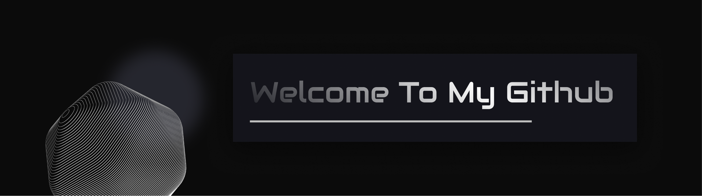

# 你好 👋 I'm Jack Suuuu

### 💻 About Me
- 🎓 [2023-Now] **Bsc in Computer Science**. (UoE)[https://www.ed.ac.uk]
- 🦾 My research interest: **AI Robotics(RL + Computer Vision/Perception), ML Systems, Operating system**, Parallel Computing(CUDA), Distributed System, and state-of-the-art ML architecture.
- ⚡ Fun fact: I hate people asking me if I play Basketball (not offend to the sport).
- 💪 Dynamic Core Weight Training / 🎾 Tennis / 🏸 Badminton /  🎮 Steam Games

### 🚀 Skills
- **Main Programming Languages I speak:** Python, C/C++, JavaScript, Typescript, HTML/CSS
- **Frameworks & Tools:** Pytorch, Trition, HuggingFace Transformer, vLLM, SGLang, Tensorflow, Ray, Langchain, Numpy, Pandas, Matplotlib, Streamlit, React & React Native...
- **Hobbies:** Fitness, reading productivity and sci-fi/crime fictions(also other genres lol), and running.

---

### ❤️‍🔥 [Check out my portfolio website](https://jacksuuu.github.io/jacksuuu-portfolio/) 

### 🖊️ [You can read my blog here](https://jack-su-blog.vercel.app/)

### 📝 [Check out my repositories](https://github.com/JackSuuu?tab=repositories)
